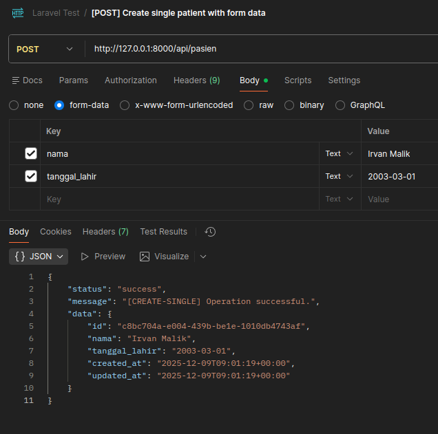
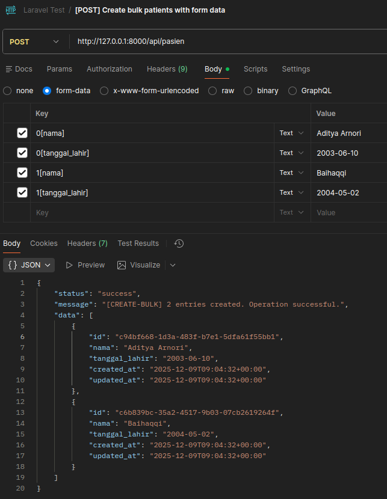
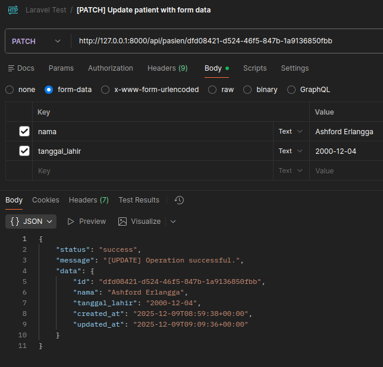

# Laravel Test

1. Install deps:

```sh
composer install
```

2. Setup database by copying `.env.example` and setting it.

3. Database migrations:

```sh
php artisan migrate:install
php artisan migrate
```

4. Running locally:

```sh
php artisan serve
```

## Screenshots

1. Create single:




2. Create bulk:




3. Get by ID:


4. Get all:


5. Update by ID:




6. Delete by ID:


